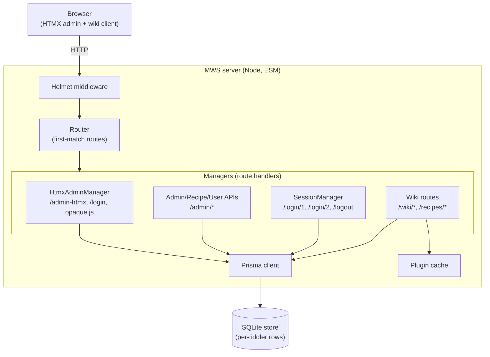
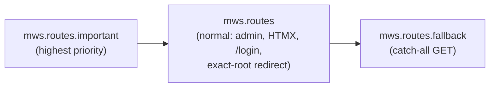
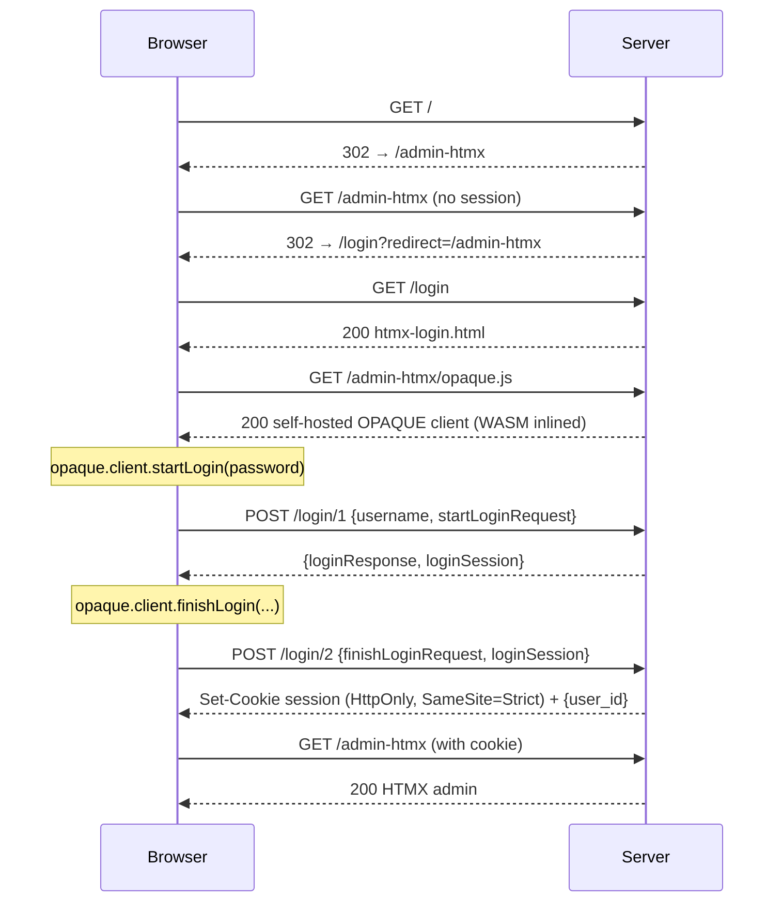
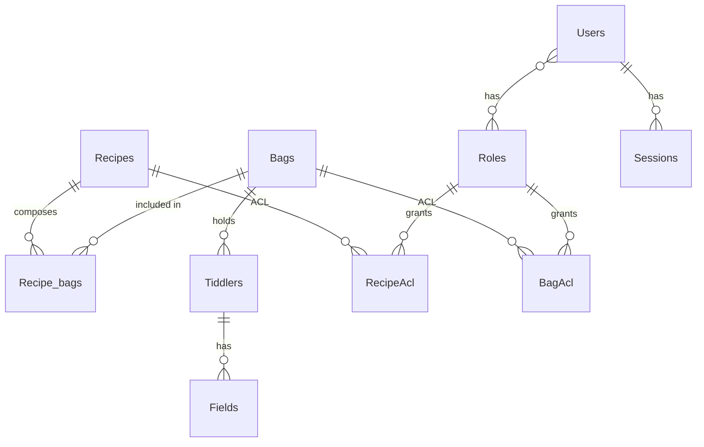

# MWS Architecture

This document describes how this MultiWikiServer (MWS) fork works, end to end. It is
the canonical architecture reference; keep it in sync with the code.

> **Admin UI status:** the admin interface is **HTMX + server-rendered HTML only**.
> The former React/Material-UI admin has been fully removed (see *Document history*).
> Authentication uses **OPAQUE** — passwords never leave the browser in plaintext.

## 1. Overview

MWS is a multi-tenant [TiddlyWiki](https://tiddlywiki.com/) server. Unlike a classic
single-file TiddlyWiki, MWS stores **each tiddler as its own row** in a SQLite database
(via Prisma), which makes concurrent, multi-user editing and fine-grained access control
possible. Wikis are composed from reusable **bags** of tiddlers through **recipes**, and
access is governed by role-based **ACLs**.

The server is a small, event-driven HTTP router written in TypeScript (ESM, Node 20+).
Its admin surface is rendered server-side as HTML and progressively enhanced with HTMX —
no client build step, no SPA bundle.

## 2. High-level architecture



## 3. Package structure

The repo is an npm workspace monorepo. The server bundle (`@tiddlywiki/mws`) is compiled
from `packages/mws` and depends on the supporting packages.

| Workspace | Role |
|---|---|
| `packages/events` | Tiny typed event emitter (`serverEvents`) used to wire everything together. |
| `packages/commander` | CLI command framework (the `mws` binary: `init-store`, `listen`, …). |
| `packages/server` | HTTP primitives: `Router`, `Streamer`/`ServerRequest`, route matching, `sendBuffer`/`sendStream`/`sendFile`, `STREAM_ENDED`, `dist_resolve`. |
| `packages/mws` | The application: managers (routes), services (sessions, cache), Prisma access, HTMX admin, templates, styles. |
| `packages/tiddlywiki-types` | Type declarations for TiddlyWiki. |
| `packages/utils` | Shared utilities. |
| `packages/multipart-parser` | Streaming multipart/form-data parser for uploads. |
| `prisma/client` | Generated Prisma client (`@tiddlywiki/mws-prisma`). |

The build is a single `tsup` step producing `dist/mws.js` (+ a stub `dist/mws.d.ts`).
There is **no client/admin build** — the admin UI is plain HTML/CSS/JS served at runtime.

## 4. Request processing pipeline

The server is wired through `serverEvents`. On listener init
(`packages/mws/src/registerRequest.ts`), routes are registered by emitting three events
**in order**, and the router resolves the **first matching** route:



- **`mws.routes.important`** — routes that must win (e.g. status endpoints).
- **`mws.routes`** — the bulk: admin/recipe/user APIs, the HTMX admin
  (`HtmxAdminManager`), the HTMX `/login` page, and the exact-root (`/^\/$/`) redirect to
  `/admin-htmx`. Because these are registered before the fallback, they match first.
- **`mws.routes.fallback`** — a catch-all `GET /^\/.*/` that **302-redirects any unmatched
  path to `/admin-htmx`** (which itself gates auth). This replaced the old React SPA
  fallback; the server no longer serves a SPA shell.

Each request is wrapped in a `ServerRequest`/`StateObject` exposing helpers such as
`sendBuffer`, `sendEmpty`, `sendFile`, `queryParams`, `pathPrefix`, `user`, and the
Prisma transaction runner. Handlers signal completion by returning/throwing the
`STREAM_ENDED` symbol.

Errors from wiki rendering are rendered by `sendWikiError`
(`packages/mws/src/managers/wiki-index.ts`) as a minimal, fully HTML-escaped error page —
no admin/SPA dependency.

## 5. The admin front door (HTMX + OPAQUE)

Every named surface has its own route; the front door is React-free:



`HtmxAdminManager` (`packages/mws/src/managers/admin-htmx.ts`) serves:

- **`GET /login`** — the HTMX login page (`templates/htmx-login.html`). Config
  (path prefix, validated redirect) is injected only as **HTML-escaped `data-*` attributes**;
  the page script reads them as plain strings, so no untrusted value is ever placed in
  executable JavaScript. The post-login `redirect` target is validated against open
  redirects (same-origin single-slash paths only).
- **`GET /admin-htmx/opaque.js`** — the `@serenity-kit/opaque` ESM client, served from
  `node_modules` (WASM inlined, ETag-cached). Self-hosted so the login page needs **no CDN**
  and works **offline**.
- **`GET /admin-htmx/styles.css`** — the admin stylesheet (`styles/admin-htmx.css`), ETag-cached.
- **`GET /admin-htmx[...]`** — the admin pages, each from a template in
  `packages/mws/src/templates/`: `recipes`, `bags`, users (`poc`), `roles`, `plugins`,
  `settings`, wrapped by the shared `htmx-admin-frame.html`. Unauthenticated requests are
  redirected to `/login`; non-admins get a 403.

Read/write actions call the JSON admin APIs (`POST /admin/$key`,
`packages/mws/src/managers/admin-utils.ts`), which require an `X-Requested-With` header and
a same-origin `referer` (CSRF defenses).

## 6. Authentication & sessions

Authentication uses the **OPAQUE** asymmetric PAKE (`@serenity-kit/opaque`,
`packages/mws/src/services/sessions.ts`):

- The user's `password` column stores an OPAQUE **registration record**, not a password
  hash that the server can test offline.
- Login is a two-message handshake (`/login/1`, `/login/2`). The plaintext password never
  leaves the browser; the server learns only that the client proved knowledge of it.
- On success the server creates a `Sessions` row and sets a **session cookie** that is
  `HttpOnly`, `SameSite=Strict`, and `Secure` when the connection is secure.
- On every request, `SessionManager.parseIncomingRequest` resolves the cookie to the
  current user (or anonymous) and attaches it as `state.user`.

## 7. Storage model — bags, recipes, tiddlers

Persistence is SQLite through Prisma (`prisma/schema.prisma`; SQLite init in
`packages/mws/src/db/sqlite-adapter.ts`). Each tiddler and each of its fields is a row.



- **Bag** — a named collection of tiddlers (the unit of storage and ACL).
- **Recipe** — an **ordered** list of bags (`Recipe_bags.position`). Reading a recipe
  overlays its bags in order; the last bag wins for a given title. Recipes are how a
  composed wiki is assembled and served.
- **Tiddlers / Fields** — per-tiddler rows (`@@unique([bag_id, title])`), with arbitrary
  fields as child rows; `is_deleted` supports tombstones for sync.
- **Users / Roles / Sessions** — accounts, role membership, and active sessions.
- **Settings** — server key/value settings.

## 8. Authorization (ACL)

Access is **role-based**. `RecipeAcl` and `BagAcl` rows attach a `Permission`
(`READ` | `WRITE` | `ADMIN`) to a `role_id`. A request's effective permissions are the
union of its user's roles' grants; admins bypass per-object checks. Recipe reads can
optionally enforce the contained bags' ACLs (`Recipe_bags.with_acl`). Helpers such as
`getBagWhereACL` build the Prisma `where` clauses that filter bags/recipes to what the
caller may see.

## 9. Security posture

Aligned with the workspace standards (NIST/OWASP, defensive coding):

- **OPAQUE auth** — no plaintext password transmission; no server-side password hash to
  exfiltrate.
- **Session cookies** — `HttpOnly`, `SameSite=Strict`, `Secure` on secure transports.
- **CSRF** — admin APIs require `X-Requested-With` plus a same-origin `referer`.
- **Open-redirect guard** — the login `redirect` parameter accepts only same-origin
  single-slash paths.
- **Output encoding** — all server-injected values in admin/login/error HTML are
  HTML-escaped; login config is passed via `data-*` attributes, never into inline JS.
- **Headers** — Helmet (`referrer-policy: strict-origin-when-cross-origin`, etc.); a
  Content-Security-Policy is applied to rendered wiki routes (`WikiStateStore.ts`).
- **Outstanding** — `npm audit` reports findings in non-admin dependency subtrees
  (TiddlyWiki/Prisma/etc.); these are tracked for a dedicated security pass and are not
  introduced by the admin code.

## 10. Build, run & deploy

```bash
# Install (this tree needs npm 10+; npm 9's Arborist crashes on the workspace peer-deps)
npx --yes npm@10 install

# Build → dist/mws.js (+ stub dist/mws.d.ts type)
npm run build

# Initialise the SQLite store (creates admin user, applies migrations, imports defaults)
npm start init-store

# Run (binds IPv6 loopback [::1]:8080 by default; http, no path prefix)
npm start
```

To change the listener (host/port/prefix/TLS), create the git-ignored
`dev/mws.dev.json` (an array of listen args). `npm start` sets `ENABLE_DEV_SERVER=mws`,
which now only gates non-admin development behaviour (wiki tiddler serving, cache); it no
longer builds any client bundle.

For a self-hosted family/household deployment (e.g. Raspberry Pi behind Tailscale), pin the
listener host explicitly and front it with Tailscale Serve for in-tailnet HTTPS.

## Document history

- The admin UI was migrated from React/Material-UI to HTMX in a phased cutover
  (front-door redirect → inline error responder → HTMX login with self-hosted OPAQUE →
  fallback repoint → deletion of `packages/react-admin` and `public/react-admin/` →
  build/skill cleanup). The `mws-cutover-check` skill guards against regression.
- Historical notes from the migration live in `HTMX_ADMIN_POC.md`,
  `HTMX_ADMIN_TESTING.md`, and `HTMX_SECURITY_FIXES.md` (superseded by this document).
