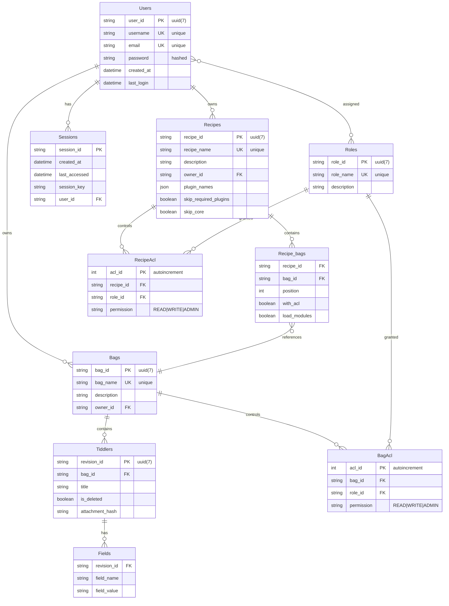

# MWS Database Schema Documentation

## Overview

MultiWikiServer uses Prisma ORM with SQLite for data persistence. The database schema is designed around TiddlyWiki's core concepts of bags, recipes, and tiddlers, extended with user management and access control.

## Schema Design Philosophy

The schema follows these principles:

1. **TiddlyWiki Compatibility**: Core concepts (bags, recipes, tiddlers) map directly to TiddlyWiki's data model
2. **Normalization**: Data is properly normalized to reduce redundancy
3. **Flexibility**: Schema supports various content types and extensibility
4. **Performance**: Indexes and relationships optimized for common queries
5. **Security**: Built-in support for access control and permissions

## Entity Relationship Diagram



## Detailed Schema

### Users Table

Stores user account information.

```sql
CREATE TABLE "users" (
    "user_id" TEXT NOT NULL PRIMARY KEY DEFAULT (uuid(7)),
    "username" TEXT NOT NULL UNIQUE,
    "email" TEXT NOT NULL UNIQUE,
    "password" TEXT NOT NULL,
    "created_at" DATETIME NOT NULL DEFAULT CURRENT_TIMESTAMP,
    "last_login" DATETIME
);
```

**Fields:**
- `user_id`: Unique identifier using 7-character UUID
- `username`: Human-readable unique username
- `email`: User's email address (unique)
- `password`: Hashed password using OPAQUE protocol
- `created_at`: Account creation timestamp
- `last_login`: Last successful login timestamp

**Indexes:**
- Primary key on `user_id`
- Unique indexes on `username` and `email`

### Roles Table

Defines user roles for access control.

```sql
CREATE TABLE "roles" (
    "role_id" TEXT NOT NULL PRIMARY KEY DEFAULT (uuid(7)),
    "role_name" TEXT NOT NULL UNIQUE,
    "description" TEXT
);
```

**Fields:**
- `role_id`: Unique identifier
- `role_name`: Human-readable role name (e.g., "admin", "editor", "viewer")
- `description`: Optional role description

**Many-to-Many with Users:**
Users can have multiple roles, and roles can be assigned to multiple users.

### Sessions Table

Manages user authentication sessions.

```sql
CREATE TABLE "sessions" (
    "session_id" TEXT NOT NULL PRIMARY KEY,
    "created_at" DATETIME NOT NULL DEFAULT CURRENT_TIMESTAMP,
    "last_accessed" DATETIME NOT NULL,
    "session_key" TEXT,
    "user_id" TEXT NOT NULL,
    FOREIGN KEY ("user_id") REFERENCES "users" ("user_id") ON DELETE NO ACTION
);
```

**Fields:**
- `session_id`: Unique session identifier
- `created_at`: Session creation time
- `last_accessed`: Last activity timestamp
- `session_key`: Optional additional session data
- `user_id`: Reference to the user

### Bags Table

Represents TiddlyWiki bags - containers for tiddlers.

```sql
CREATE TABLE "bags" (
    "bag_id" TEXT NOT NULL PRIMARY KEY DEFAULT (uuid(7)),
    "bag_name" TEXT NOT NULL UNIQUE,
    "description" TEXT NOT NULL,
    "owner_id" TEXT,
    FOREIGN KEY ("owner_id") REFERENCES "users" ("user_id")
);
```

**Fields:**
- `bag_id`: Unique identifier
- `bag_name`: Human-readable bag name (unique)
- `description`: Bag description
- `owner_id`: Optional reference to owning user

**Key Features:**
- Bags can exist without owners (system bags)
- Bag names must be unique across the system
- Supports access control via BagAcl

### Recipes Table

Represents TiddlyWiki recipes - aggregations of bags with specific configurations.

```sql
CREATE TABLE "recipes" (
    "recipe_id" TEXT NOT NULL PRIMARY KEY DEFAULT (uuid(7)),
    "recipe_name" TEXT NOT NULL UNIQUE,
    "description" TEXT NOT NULL,
    "owner_id" TEXT,
    "plugin_names" TEXT NOT NULL, -- JSON array
    "skip_required_plugins" BOOLEAN NOT NULL DEFAULT FALSE,
    "skip_core" BOOLEAN NOT NULL DEFAULT FALSE,
    FOREIGN KEY ("owner_id") REFERENCES "users" ("user_id")
);
```

**Fields:**
- `recipe_id`: Unique identifier
- `recipe_name`: Human-readable recipe name (unique)
- `description`: Recipe description
- `owner_id`: Optional reference to owning user
- `plugin_names`: JSON array of plugin names to include
- `skip_required_plugins`: Whether to skip required plugins
- `skip_core`: Whether to skip core TiddlyWiki modules

**JSON Schema for plugin_names:**
```typescript
type PluginNames = string[];
// Example: ["$:/plugins/tiddlywiki/markdown", "$:/plugins/custom/theme"]
```

### Recipe_bags Table

Junction table defining which bags are included in recipes and their configuration.

```sql
CREATE TABLE "recipe_bags" (
    "recipe_id" TEXT NOT NULL,
    "bag_id" TEXT NOT NULL,
    "position" INTEGER NOT NULL,
    "with_acl" BOOLEAN NOT NULL DEFAULT FALSE,
    "load_modules" BOOLEAN NOT NULL DEFAULT FALSE,
    PRIMARY KEY ("recipe_id", "bag_id"),
    FOREIGN KEY ("recipe_id") REFERENCES "recipes" ("recipe_id") ON DELETE CASCADE,
    FOREIGN KEY ("bag_id") REFERENCES "bags" ("bag_id") ON DELETE CASCADE
);
```

**Fields:**
- `recipe_id`: Reference to recipe
- `bag_id`: Reference to bag
- `position`: Order of bag in recipe (0-based)
- `with_acl`: Whether to apply bag's ACL rules
- `load_modules`: Whether to load modules from this bag

**Key Features:**
- Composite primary key prevents duplicate bag inclusions
- Position determines precedence in recipe evaluation
- Cascade deletes maintain referential integrity

### Tiddlers Table

Stores individual tiddlers (content items).

```sql
CREATE TABLE "tiddlers" (
    "revision_id" TEXT NOT NULL PRIMARY KEY DEFAULT (uuid(7)),
    "bag_id" TEXT NOT NULL,
    "title" TEXT NOT NULL,
    "is_deleted" BOOLEAN NOT NULL,
    "attachment_hash" TEXT,
    UNIQUE ("bag_id", "title"),
    FOREIGN KEY ("bag_id") REFERENCES "bags" ("bag_id") ON DELETE CASCADE
);
```

**Fields:**
- `revision_id`: Unique identifier for this tiddler revision
- `bag_id`: Reference to containing bag
- `title`: Tiddler title (unique within bag)
- `is_deleted`: Soft delete flag
- `attachment_hash`: Optional hash for binary attachments

**Key Features:**
- Each tiddler revision gets a unique ID
- Titles are unique within bags but can repeat across bags
- Soft delete preserves revision history
- Binary attachments stored separately, referenced by hash

### Fields Table

Stores tiddler metadata and content as key-value pairs.

```sql
CREATE TABLE "fields" (
    "revision_id" TEXT NOT NULL,
    "field_name" TEXT NOT NULL,
    "field_value" TEXT NOT NULL,
    PRIMARY KEY ("revision_id", "field_name"),
    FOREIGN KEY ("revision_id") REFERENCES "tiddlers" ("revision_id") ON DELETE CASCADE
);
```

**Fields:**
- `revision_id`: Reference to tiddler revision
- `field_name`: Field name (e.g., "text", "type", "modified", "tags")
- `field_value`: Field value (always stored as text)

**Common Field Names:**
- `text`: Tiddler content
- `type`: Content type (e.g., "text/vnd.tiddlywiki")
- `modified`: Last modification timestamp
- `modifier`: User who last modified
- `tags`: Space-separated tag list
- `created`: Creation timestamp
- `creator`: User who created the tiddler

### Access Control Tables

#### BagAcl Table

Controls access to individual bags.

```sql
CREATE TABLE "bag_acl" (
    "acl_id" INTEGER PRIMARY KEY AUTOINCREMENT,
    "bag_id" TEXT NOT NULL,
    "role_id" TEXT NOT NULL,
    "permission" TEXT NOT NULL CHECK ("permission" IN ('READ', 'WRITE', 'ADMIN')),
    FOREIGN KEY ("bag_id") REFERENCES "bags" ("bag_id") ON DELETE CASCADE,
    FOREIGN KEY ("role_id") REFERENCES "roles" ("role_id")
);
```

#### RecipeAcl Table

Controls access to recipes.

```sql
CREATE TABLE "recipe_acl" (
    "acl_id" INTEGER PRIMARY KEY AUTOINCREMENT,
    "recipe_id" TEXT NOT NULL,
    "role_id" TEXT NOT NULL,
    "permission" TEXT NOT NULL CHECK ("permission" IN ('READ', 'WRITE', 'ADMIN')),
    FOREIGN KEY ("recipe_id") REFERENCES "recipes" ("recipe_id") ON DELETE CASCADE,
    FOREIGN KEY ("role_id") REFERENCES "roles" ("role_id")
);
```

**Permission Levels:**
- `READ`: View content
- `WRITE`: Modify content
- `ADMIN`: Full administrative access

## Indexes and Performance

### Primary Indexes

All tables have primary key indexes automatically created:
- `users(user_id)`
- `roles(role_id)`
- `bags(bag_id)`
- `recipes(recipe_id)`
- `tiddlers(revision_id)`
- `fields(revision_id, field_name)`

### Secondary Indexes

Critical indexes for performance:

```sql
-- User lookups
CREATE UNIQUE INDEX "users_username_idx" ON "users" ("username");
CREATE UNIQUE INDEX "users_email_idx" ON "users" ("email");

-- Session management
CREATE INDEX "sessions_user_id_idx" ON "sessions" ("user_id");
CREATE INDEX "sessions_last_accessed_idx" ON "sessions" ("last_accessed");

-- Content lookups
CREATE UNIQUE INDEX "bags_name_idx" ON "bags" ("bag_name");
CREATE UNIQUE INDEX "recipes_name_idx" ON "recipes" ("recipe_name");
CREATE UNIQUE INDEX "tiddlers_bag_title_idx" ON "tiddlers" ("bag_id", "title");
CREATE INDEX "tiddlers_bag_id_idx" ON "tiddlers" ("bag_id");

-- Recipe composition
CREATE INDEX "recipe_bags_recipe_id_idx" ON "recipe_bags" ("recipe_id");
CREATE INDEX "recipe_bags_position_idx" ON "recipe_bags" ("recipe_id", "position");

-- Field queries
CREATE INDEX "fields_revision_id_idx" ON "fields" ("revision_id");
CREATE INDEX "fields_name_value_idx" ON "fields" ("field_name", "field_value");

-- ACL lookups
CREATE INDEX "bag_acl_bag_id_idx" ON "bag_acl" ("bag_id");
CREATE INDEX "bag_acl_role_id_idx" ON "bag_acl" ("role_id");
CREATE INDEX "recipe_acl_recipe_id_idx" ON "recipe_acl" ("recipe_id");
CREATE INDEX "recipe_acl_role_id_idx" ON "recipe_acl" ("role_id");
```

## Common Queries

### User Authentication

```sql
-- Verify user login
SELECT user_id, username, password 
FROM users 
WHERE username = ? AND email = ?;

-- Get user roles
SELECT r.role_name, r.description
FROM roles r
JOIN user_roles ur ON r.role_id = ur.role_id
WHERE ur.user_id = ?;
```

### Content Access

```sql
-- Get tiddlers in a bag
SELECT t.title, t.revision_id, t.is_deleted
FROM tiddlers t
WHERE t.bag_id = ? AND t.is_deleted = FALSE
ORDER BY t.title;

-- Get tiddler fields
SELECT f.field_name, f.field_value
FROM fields f
WHERE f.revision_id = ?;

-- Get recipe composition
SELECT b.bag_name, rb.position, rb.with_acl
FROM recipe_bags rb
JOIN bags b ON rb.bag_id = b.bag_id
WHERE rb.recipe_id = ?
ORDER BY rb.position;
```

### Permission Checks

```sql
-- Check bag access
SELECT ba.permission
FROM bag_acl ba
JOIN user_roles ur ON ba.role_id = ur.role_id
WHERE ba.bag_id = ? AND ur.user_id = ?;

-- Check recipe access
SELECT ra.permission
FROM recipe_acl ra
JOIN user_roles ur ON ra.role_id = ur.role_id
WHERE ra.recipe_id = ? AND ur.user_id = ?;
```

## Migration Strategy

### Version Control

Prisma manages schema versions through migrations:

```
prisma/migrations/
├── 20250606001949_init/
│   └── migration.sql
├── 20250613000526_remove_group/
│   └── migration.sql
└── migration_lock.toml
```

### Migration Best Practices

1. **Always backup before migrations**
2. **Test migrations on development data**
3. **Use transactions for complex migrations**
4. **Document breaking changes**
5. **Provide rollback procedures**

### Example Migration

```sql
-- Add new column with default value
ALTER TABLE "users" ADD COLUMN "profile_image" TEXT DEFAULT NULL;

-- Create index for new column
CREATE INDEX "users_profile_image_idx" ON "users" ("profile_image");

-- Update existing records if needed
UPDATE "users" SET "profile_image" = '/default-avatar.png' 
WHERE "profile_image" IS NULL;
```

## Data Integrity

### Constraints

The schema enforces data integrity through:

1. **Primary Keys**: Unique row identification
2. **Foreign Keys**: Referential integrity
3. **Unique Constraints**: Prevent duplicates
4. **Check Constraints**: Validate enum values
5. **NOT NULL**: Required fields

### Cascade Rules

- `ON DELETE CASCADE`: Child records deleted with parent
- `ON DELETE NO ACTION`: Prevents deletion if children exist
- `ON UPDATE CASCADE`: Updates propagate to children

### Transaction Usage

Critical operations use transactions:

```typescript
await prisma.$transaction(async (tx) => {
  // Create tiddler
  const tiddler = await tx.tiddlers.create({
    data: { bag_id, title, is_deleted: false }
  });
  
  // Create fields
  await tx.fields.createMany({
    data: fields.map(([name, value]) => ({
      revision_id: tiddler.revision_id,
      field_name: name,
      field_value: value
    }))
  });
  
  return tiddler;
});
```

## Backup and Recovery

### Backup Strategy

1. **Regular Snapshots**: Automated daily backups
2. **Export Functions**: SQL dumps for portability
3. **Binary Backups**: Complete SQLite file copies
4. **Incremental Backups**: Track changes since last backup

### Recovery Procedures

1. **Point-in-Time Recovery**: Restore to specific timestamp
2. **Selective Recovery**: Restore specific tables/data
3. **Validation**: Verify backup integrity
4. **Testing**: Regular recovery drills

## Performance Tuning

### Query Optimization

1. **Use Indexes**: Ensure queries use appropriate indexes
2. **Limit Results**: Use LIMIT/OFFSET for pagination
3. **Select Specific Fields**: Avoid SELECT *
4. **Join Optimization**: Use appropriate join types

### Database Configuration

```sql
-- SQLite optimizations
PRAGMA journal_mode = WAL;
PRAGMA synchronous = NORMAL;
PRAGMA cache_size = 10000;
PRAGMA temp_store = MEMORY;
```

### Monitoring

Track key metrics:
- Query execution times
- Index usage statistics
- Connection pool utilization
- Cache hit rates
- Database file size growth

This schema provides a solid foundation for MWS while maintaining compatibility with TiddlyWiki's core concepts and supporting modern web application requirements.
