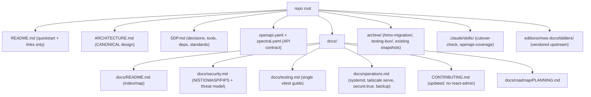

# Documentation plan — review, duplication, proposed structure

> WIP / parking doc. The doc-restructure work itself is NOT yet done (this is the plan).

## Per-artifact disposition

| File | Disposition | Notes |
|---|---|---|
| `README.md` | **UPDATE** | Stale: "security is a dumpster fire", an OAuth claim (auth is OPAQUE), `npm install` (needs npm 10), plaintext default password. |
| `ARCHITECTURE.md` | **KEEP (canonical)** | Accurate. Minor: §9 "npm audit outstanding" is now 0; add the `secure:true` listener note to §10. |
| `HTMX_ADMIN_POC.md` | **ARCHIVE** | Self-marked superseded; body still calls React "current" (historical). |
| `HTMX_ADMIN_TESTING.md` | **MERGE → ARCHIVE** | References Bun tests; reconcile into one testing doc (toolchain is vitest). |
| `HTMX_SECURITY_FIXES.md` | **ARCHIVE** | Valuable security history; the "/login & / for React compat" rationale is obsolete. |
| `PLANNING.md` | **KEEP → relocate** `docs/roadmap/` | Upstream-flavoured backlog, not this fork's plan. |
| `admin-refactor.md` | **ARCHIVE** | Flask/Alpine options analysis never used. |
| `TESTING_COMPLETE.md` / `TEST_HARNESS_SUMMARY.md` / `TEST_QUICK_START.md` | **MERGE → ARCHIVE** | Bun-based; overlapping; numbers unverifiable. Fold into `docs/testing.md`. |
| `CONTRIBUTING.md` | **UPDATE** | Stale: describes the deleted `react-admin`/`setupDevServer.ts`. Event-flow content still good. (Also now carries the pre-push hook opt-in note.) |
| `openapi.yaml` / `.spectral.yaml` | **KEEP (canonical API doc)** | Current. Minor: `externalDocs.url` points at upstream, not this fork's ARCHITECTURE. |
| `.claude/skills/*/SKILL.md` | **KEEP** | Accurate. |
| `editions/mws-docs/tiddlers/*` | **KEEP (vendored upstream)** | End-user wiki docs; sync from upstream, don't fork-edit topic-by-topic. |
| `archive/**`, `packages/*/README.md`, `create-package/*` | **KEEP** | Historical / third-party / separate package. |

## Duplication hotspots (consolidate to one home)

| Topic | Currently in | Single home |
|---|---|---|
| OPAQUE login flow | ARCHITECTURE §5-6, openapi info, wiki tiddlers, HTMX_SECURITY_FIXES | ARCHITECTURE + openapi |
| Bag/Recipe/ACL model | ARCHITECTURE §7-8, openapi info, several tiddlers | ARCHITECTURE (tiddlers = vendored) |
| Build/run/deploy steps | README, ARCHITECTURE §10, PoC/security/testing docs, Installation tiddler | ARCHITECTURE §10 |
| Test harness / how-to | 4 overlapping Bun-vs-vitest docs | one `docs/testing.md` |
| CSRF (X-Requested-With + referer) | ARCHITECTURE §9, HTMX_SECURITY_FIXES, openapi | ARCHITECTURE §9 |
| React→HTMX migration narrative | ARCHITECTURE history, PoC, admin-refactor, cutover skill, CONTRIBUTING | SDP + ARCHITECTURE history line |

## Proposed structure

Rationale: one canonical home per topic (ARCHITECTURE = design, openapi = contract, SDP =
decisions), consolidate the scattered security/testing/ops prose into `docs/`, archive the
migration + Bun-era history, leave vendored tiddlers as upstream-sync content.
