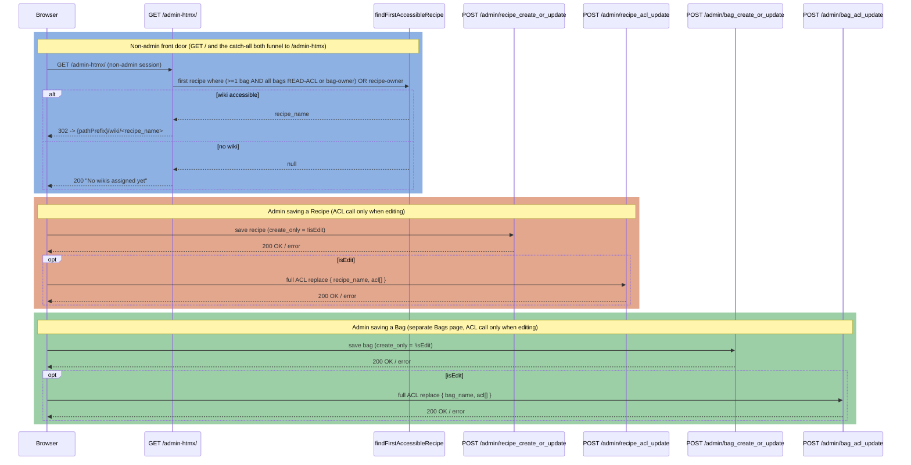

# Security

Security standards, controls, and known gaps for this fork. This is the consolidated
security home; the canonical design detail lives in [`../ARCHITECTURE.md`](../ARCHITECTURE.md)
§9 and the decision/standards record in [`SDP.md`](SDP.md) §6–8.

A core security objective of this fork is **a reduced, more auditable footprint**: replacing the
React/Material-UI admin with server-rendered HTMX removes a large client bundle and its build
toolchain, shrinking the third-party **supply-chain attack surface** and the amount of code that
must be trusted. This applies to any multi-user/multi-wiki deployment, not just the reference
family-app deployment.

## Standards posture

| Standard | Status |
|---|---|
| **NIST** | SP 800-63B-style authentication via OPAQUE (no password transmitted or stored as a recoverable hash). Session cookie is `HttpOnly` + `SameSite=Strict` + `Secure` (behind a TLS-terminating proxy with `secure=true`). **Gap:** no SP 800-53 control mapping; no documented key-rotation procedure for the password master key (`passwords.key`). |
| **OWASP** | API Top-10 ruleset wired via `.spectral.yaml`, enforced by the `openapi-coverage` skill at `--fail-severity=error`. CSRF (`X-Requested-With` + same-origin referer **host**), output escaping, **login rate-limiting** (per-username throttle on `/login/1`, see below), and the broken-access-control + error-handling fixes. **Gap:** no general per-route rate limiting (OWASP API4 is `warn`-only); no anti-CSRF token (defense-in-depth). |
| **FIPS 140-3** | **Not FIPS-validated**, and largely cannot be without major change (OPAQUE's WASM crypto, Tailscale transport, and the Pi/Debian host are not validated modules). **Recorded decision: FIPS-140-3 is a documented non-goal for the current reference deployment (tailnet-only, behind Tailscale).** A deployment with stricter requirements would need the phased path in `SDP.md` §7. Do not claim FIPS compliance. See [`SDP.md`](SDP.md) §7 for the full analysis and the phased path if it ever becomes a requirement. |

> Note: the workspace standard references FIPS 140-2; 140-2 is superseded by **140-3**, which
> is the version assessed here.

## Default credentials — UK PSTI alignment

MWS no longer ships a universal default password. On first `init-store`, the `admin` account is
created with a **cryptographically-random, unique-per-install password** (24 chars over an
unambiguous 56-symbol set ≈ 139 bits of entropy, via `node:crypto`) that is **printed once** to
the operator's console. It can be changed at any time with `mws reset-password admin
<new-password>` or from the HTMX admin profile.

This aligns with the **intent** of the UK **Product Security and Telecommunications
Infrastructure (PSTI) Act 2022** and the **PSTI (Security Requirements for Relevant Connectable
Products) Regulations 2023 (SI 2023/1007), Schedule 1, Part 1, paragraph 1** (in force
29 April 2024; enforced by the Office for Product Safety & Standards). Para 1(2) requires a
manufacturer-set password to be:

- *"unique per product"* — **met**: each install's password is independently CSPRNG-generated; or
- *"defined by the user of the product"* — **also available**: rotate immediately via
  `reset-password`.

Para 1(3) prohibits passwords that are *"based on incremental counters"*, *"based on or derived
from publicly available information"*, derived from identifiers such as serial numbers (absent
good-practice hashing), or *"otherwise guessable"* — a random value derived from none of these
satisfies all of them.

> **Scope note (no over-claim):** the PSTI regime legally binds *manufacturers, importers and
> distributors placing relevant connectable products on the UK market*. A self-hosted,
> open-source server fork is not a "product placed on the market", so the Act does **not
> directly apply**; this change adopts its **intent** (eliminating universal/guessable default
> passwords). It is not a claim of formal PSTI conformity or certification.

**References (verified against legislation.gov.uk):**
- PSTI Act 2022 (c. 46): <https://www.legislation.gov.uk/ukpga/2022/46>
- PSTI (Security Requirements…) Regulations 2023 (SI 2023/1007), Schedule 1:
  <https://www.legislation.gov.uk/uksi/2023/1007/schedule/1/made>

## Implemented controls

- **OPAQUE authentication** — two-step handshake (`POST /login/1` → `/login/2`); the server
  never sees the plaintext password and stores no recoverable hash.
- **Session cookies** — `HttpOnly`, `SameSite=Strict`, and `Secure` when the listener runs
  with `secure=true` (`expectSecure`). See `packages/mws/src/managers/sessions.ts`.
- **CSRF** — admin APIs require the `X-Requested-With: TiddlyWiki` header (primary guard) and
  a same-origin `referer` whose **host** matches the request Host. The host check closed an
  `evil.com/admin` bypass that the earlier pathname-only check allowed; verified live behind
  `tailscale serve`. See `packages/mws/src/managers/admin-utils.ts`.
- **Login rate-limiting** — an in-memory, per-username throttle on `POST /login/1`
  (`SessionManager.checkLoginRateLimit`): after a burst of login starts within a window the
  username is locked out for a cooldown. Keyed by username because behind Tailscale Serve the
  client IP is always the loopback proxy; with OPAQUE a wrong password fails client-side, so the
  `/login/1` start is the server-side attempt signal. Resets on process restart; the tracked-username
  map is hard-capped (LRU eviction) so a username-spray cannot exhaust memory.
- **Tailscale SSO (optional, off by default)** — when `MWS_TAILSCALE_SSO=1`, a request carrying a
  `Tailscale-User-Login` header is matched to a user's `tailscale_login` and authenticated
  **passwordlessly, per request** (no session row); roles are as mapped. **Relies on these
  invariants:** MWS binds **loopback only**, is fronted by **Tailscale Serve** (which strips any
  client-supplied `Tailscale-*` headers and injects the verified identity), and **Funnel is OFF**
  (public requests carry no header → fall through to password). **Deny-unless-mapped** (no
  auto-provision); disabled users are rejected. See `SessionManager.resolveTailscaleSSO`.
- **Logout under SSO (suppress marker)** — because SSO is stateless, clearing the session cookie
  alone would let the very next request re-authenticate from the identity header, so logout could
  never "stick." Logout therefore sets a short-lived (~5 min) `mws_no_sso` cookie (HttpOnly,
  SameSite=Strict, Secure under TLS) that `parseIncomingRequest` honours **before** SSO, landing
  the user on `/login` so they can sign in as a different persona. A valid session cookie still
  takes precedence (password login wins), and the marker is cleared on login. It can only *force*
  password login (more friction, never less) and is TTL-bounded; `GET /resume-sso` clears it to
  resume SSO immediately. See `services/sessions.ts`.
- **User home page (`/home`)** — a logged-in non-admin lands on a standalone page listing the wikis
  they may READ (reference/doc wikis open in a new tab), with a logout control and — when permitted
  — a manage-wikis link; an admin keeps the admin UI. Replaces the earlier dead-end redirect and
  the no-wiki page. See `managers/admin-htmx.ts`.
- **Authorization (ACL)** — role-based read/write on bags and recipes. A high-severity fix
  corrected `getRecipeACL`/`getBagACL` to read `roles.map(r => r.role_id)` (the code previously
  read an always-`undefined` `role_ids`, so non-admins could only reach resources they owned).
  See `packages/mws/src/RequestState.ts`. The grant chain is **User → Role → ACL(role,
  permission) → Bag/Recipe**, where `permission` is hierarchical `READ < WRITE < ADMIN`
  (READ = download / read-only, WRITE = edit on the server, ADMIN = manage that resource).
- **Admin least privilege for content** — `ADMIN`-role users are **not** exempt from content
  ACLs. `getRecipeACL`/`getBagACL` previously short-circuited the read/write checks to an
  always-pass query for admins; that bypass is removed, so reading or writing a wiki's tiddler
  content requires an explicit ACL grant or ownership for everyone, including admins. An admin's
  authority is to administer *structure* (recipes, bags, ACLs, users) via the admin panel, which
  is gated separately and still lists every resource. The initial `admin` account created by
  `init-store` is given the `USER` role in addition to `ADMIN`, so it reads the default reference
  wikis through the seeded `USER → READ` grants rather than any bypass. See
  `packages/mws/src/RequestState.ts` and `packages/mws/src/commands/init-store.ts`.
- **`WIKI_ADMIN` data-management tier** — a middle authorization tier between content
  permissions and site administration. The full model is:
  **READ** (download / local use) < **WRITE** (server-side content edit) < **`WIKI_ADMIN`**
  (structure: create & delete recipes and bags) < **`ADMIN`** (system administration: users,
  roles, every ACL, owner reassignment). Creating a recipe or bag previously required only a
  logged-in session; it now requires `ADMIN` or `WIKI_ADMIN` (or, for editing/deleting an
  existing resource, ownership). A `WIKI_ADMIN` reaches the Recipes and Bags admin pages to do
  this, but the admin frame is rendered with the real `isAdmin` flag, so the Users / Roles /
  Settings sections stay hidden and remain `isAdmin`-gated at the API. Holding `WIKI_ADMIN`
  grants **no** content-ACL bypass and **no** owner reassignment — those stay `isAdmin`-only
  (least privilege). The role is seeded on fresh installs by `init-store`; existing deployments
  add it via the admin Roles UI. The role name is defined once as the `WIKI_ADMIN_ROLE` constant
  (value `"WIKI_ADMIN"`) in `packages/mws/src/services/roles.ts`, which the seed and the
  authorization checks both import. See `packages/mws/src/services/roles.ts`,
  `packages/mws/src/managers/admin-recipes.ts`, and `packages/mws/src/managers/admin-htmx.ts`.
- **Role-count soft cap** — `role_create` refuses to create more than `ROLE_SOFT_CAP` (20) roles,
  a guard against accidental role sprawl (no DB constraint; trivially raised in code). See
  `packages/mws/src/managers/admin-users.ts`.
- **Access-management UI** — admins set, change, and remove role→permission grants from the
  **Recipes** and **Bags** edit modals ("Access (roles)" section), wired to the existing
  `recipe_acl_update` / `bag_acl_update` admin keys (full-replace semantics). Previously these
  keys had no UI and were reachable only by direct API call.
- **Non-admin landing** — the front door (`GET /`) and the catch-all both funnel to
  `/admin-htmx`; a logged-in **non-admin** is now redirected from there to their first accessible
  wiki (`/wiki/{recipe}`) instead of a dead-end 403. A non-admin with no granted wiki sees a
  friendly "no wikis assigned" page (HTTP 200), not 403. See `packages/mws/src/managers/admin-htmx.ts`.
- **Baseline role assignment** — `user_create` assigns the `USER` role when the admin selects
  none, so users are never created role-less (which would deny all default wiki access). An
  **enabled** user must keep at least one role; only a **disabled (locked)** account may have all
  roles removed. See `packages/mws/src/managers/admin-users.ts`.

### Access flow

Non-admin front door (landing) and the admin ACL-grant flows, as implemented:

> **Least-privilege caveat (current state):** an `isAdmin` user still **bypasses** the content
> ACL in `getRecipeACL`/`getBagACL`, so admins can read/write every wiki today. Removing that
> blanket bypass (so admins reach content only via role/ownership) is planned for the next batch —
> see [`SDP.md`](SDP.md) and [`TODO.md`](TODO.md).

- **Error contract** — `Streamer.catcher` honours `SendError.status`/`reason` instead of
  blanket-500ing, so an unauthorized request surfaces as `403`, not `500`.
- **Open-redirect guard** — the login `redirect` parameter accepts only same-origin
  single-slash paths.
- **Output encoding** — server-injected values in admin/login/error HTML are HTML-escaped;
  login config is passed via `data-*` attributes, never inlined into JS.
- **Headers** — Helmet defaults; a Content-Security-Policy is applied to rendered wiki routes.
- **Dependency audit** — `npm audit --omit=dev` reports **0** vulnerabilities; the pre-push
  gate enforces `npm audit --omit=dev --audit-level=high`.

## Threat model

> **Gap — starting point only.** A full STRIDE threat model with documented trust boundaries
> does not yet exist (tracked in [`SDP.md`](SDP.md) §8 and [`TODO.md`](TODO.md)). The table
> below is a seed to be completed, not an assessment of record.

| STRIDE | Surface | Current mitigation | Open |
|---|---|---|---|
| **S**poofing | Login | OPAQUE; session cookie; login rate-limiting (per-username) | Distributed/credential-stuffing across many usernames |
| **T**ampering | Admin/sync APIs | CSRF header + referer-host; ACL | Anti-CSRF token |
| **R**epudiation | Admin actions | Server event log | Audit-log retention policy |
| **I**nfo disclosure | Tiddler/bag reads | ACL; `Secure` cookie over TLS | At-rest encryption |
| **D**oS | All routes | Tailnet-only exposure | Rate limiting |
| **E**levation | ACL | Role-grant model; admin bypass is explicit | Control mapping (SP 800-53) |

## Operational guidance

- **Record the unique random admin password** that `init-store` prints once (see *Default
  credentials* below), and change it promptly with `npm start reset-password admin
  <new-password>` or from the HTMX admin profile.
- Match exposure to your trust model. The security model is still maturing (as upstream notes),
  so do not place it on an untrusted network without an independent review; the reference
  deployment keeps it **tailnet-only** (Tailscale Serve).
- Protect `passwords.key` (the password master salt) — losing or changing it invalidates all
  stored passwords.

See also: [`operations.md`](operations.md) for deployment hardening and [`testing.md`](testing.md)
for the security-relevant tests and the pre-push gate.
