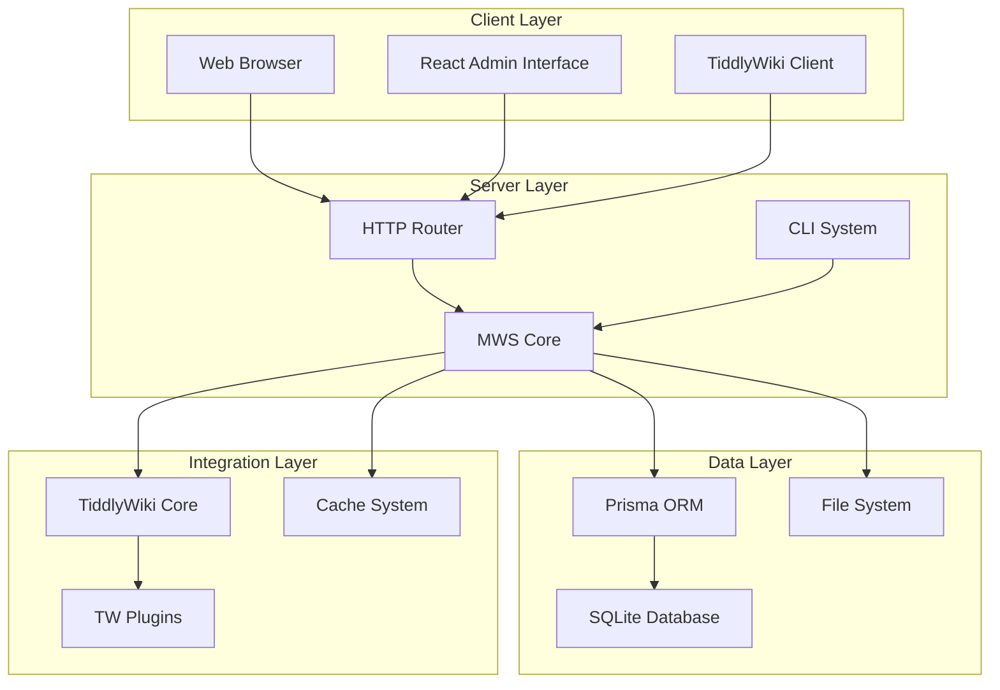
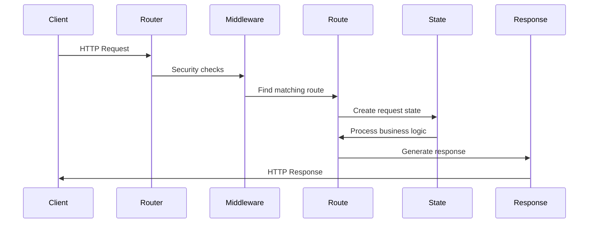
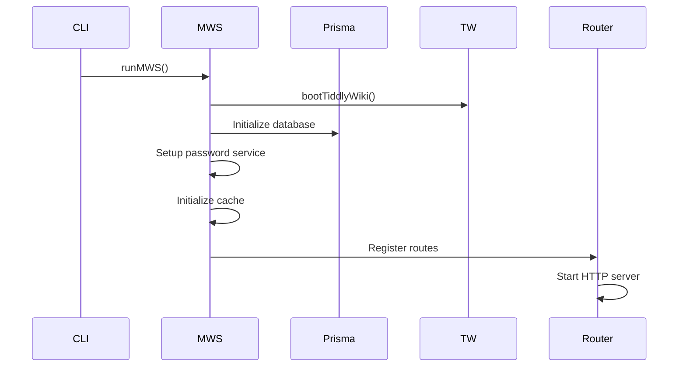
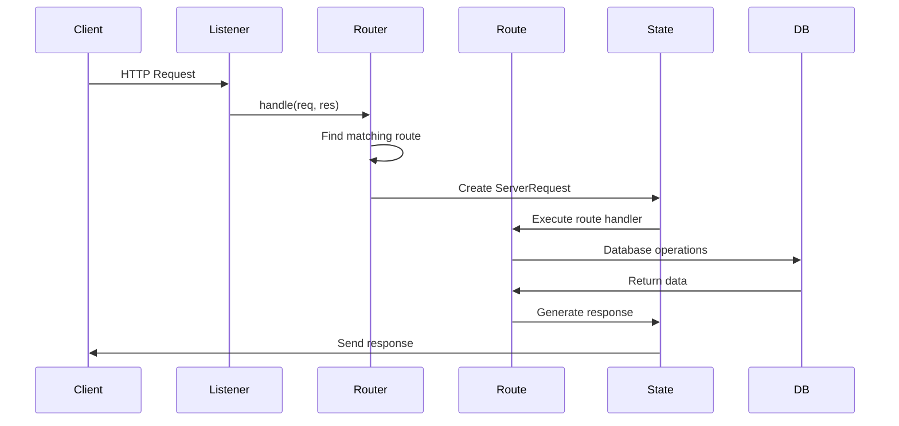
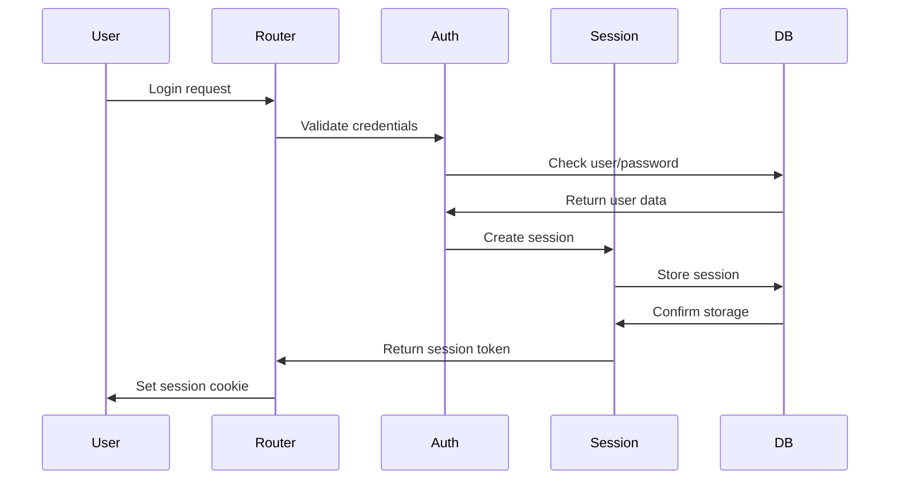

# MWS Architecture Guide

## Overview

MultiWikiServer (MWS) is built on a modern, event-driven architecture that separates concerns into focused packages while maintaining tight integration with TiddlyWiki's core concepts.

## High-Level Architecture



## Core Components

### 1. Event-Driven Communication

The entire system is built around a centralized event system (`@tiddlywiki/events`) that enables loose coupling between components.

```typescript
// Example event usage
serverEvents.on("mws.init.before", async (config, $tw) => {
  // Setup logic before server initialization
});

serverEvents.emitAsync("mws.routes", router.rootRoute, router.config);
```

**Key Events:**
- `mws.init.*` - Server lifecycle events
- `mws.router.*` - Routing system events
- `mws.routes.*` - Route registration events
- `cli.*` - Command-line interface events
- `request.*` - HTTP request processing events

### 2. Package Structure

The monorepo structure enables clear separation of concerns:

```
packages/
├── commander/      # CLI command system
├── events/         # Event infrastructure
├── mws/           # Core server logic
├── react-admin/   # Admin interface
├── server/        # HTTP server
└── tiddlywiki-types/ # Type definitions
```

Each package has a specific responsibility and communicates through the event system.

### 3. Request Processing Pipeline



### 4. Database Integration

MWS uses Prisma ORM for database operations with a custom adapter pattern:

```typescript
class ServerState {
  constructor(
    private paths: ServerPaths,
    private $tw: TW,
    private engine: PrismaEngineClient,
    private passwordService: PasswordService,
    private cache: TiddlerCache
  ) {}
  
  async $transaction<R>(
    fn: (prisma: PrismaTxnClient) => Promise<R>
  ): Promise<R> {
    return this.engine.$transaction(fn);
  }
}
```

## Data Flow

### 1. Server Startup



### 2. Request Handling



### 3. TiddlyWiki Integration

MWS integrates deeply with TiddlyWiki's architecture:

```typescript
// Boot TiddlyWiki with custom configuration
const $tw = await bootTiddlyWiki(wikiPath);

// Access TiddlyWiki's module system
$tw.modules.forEachModuleOfType("route", (title, routeDefinition) => {
  server.addRoute(routeDefinition);
});

// Use TiddlyWiki's plugin system
$tw.hooks.addHook("th-server-command-post-start", handler);
```

## Security Architecture

### 1. Authentication Flow



### 2. Authorization Model

The system uses a role-based access control (RBAC) model:

```
Users → Roles → Permissions
  ↓       ↓         ↓
 ACL → Bags ← Recipes
```

**Permission Types:**
- `READ` - View content
- `WRITE` - Modify content  
- `ADMIN` - Administrative access

### 3. Route Protection

Routes are protected using middleware and validation:

```typescript
// Example protected route
Z2.POST("/api/admin/{command}")
  .params(z.object({ command: z.string() }))
  .body("json", AdminCommandSchema)
  .response(z.object({ success: z.boolean() }))
  .register(router.rootRoute, async (state) => {
    // Authentication check
    if (!state.user) throw new Error("Unauthorized");
    
    // Permission check
    if (!state.user.hasPermission("ADMIN")) {
      throw new Error("Insufficient permissions");
    }
    
    // Execute command
    return await executeAdminCommand(state.data);
  });
```

## Plugin Architecture

### 1. Plugin System

MWS supports both TiddlyWiki plugins and custom MWS plugins:

```
plugins/
├── client/         # Client-side TiddlyWiki plugin
│   ├── src/       # TypeScript source
│   └── tiddlers/  # TiddlyWiki tiddlers
└── server/        # Server-side TiddlyWiki plugin
    ├── plugin.info
    └── *.js       # Server modules
```

### 2. Plugin Integration

Plugins can extend the system through:

- **Route Registration**: Add new HTTP endpoints
- **Event Handlers**: React to system events
- **Middleware**: Add request processing logic
- **Commands**: Extend the CLI
- **UI Components**: Add admin interface elements

```typescript
// Example plugin registration
serverEvents.on("mws.routes", (rootRoute, config) => {
  rootRoute.defineRoute({
    method: ["GET"],
    path: /^\/my-plugin\/(.+)$/,
    bodyFormat: "ignore"
  }, async (state) => {
    // Plugin logic here
  });
});
```

## Performance Considerations

### 1. Caching Strategy

MWS implements multi-level caching:

- **Memory Cache**: Hot data in server memory
- **File Cache**: Compiled tiddlers on disk
- **Database Cache**: Query result caching
- **HTTP Cache**: Browser caching headers

### 2. Database Optimization

- **Connection Pooling**: Efficient database connections
- **Query Optimization**: Prisma query optimization
- **Indexing**: Strategic database indexes
- **Transactions**: Atomic operations for consistency

### 3. Static Asset Handling

- **Development**: Live reloading with esbuild
- **Production**: Pre-built static assets
- **CDN Ready**: Cacheable static resources

## Scalability Design

### 1. Horizontal Scaling

The architecture is designed to support horizontal scaling:

- **Stateless Request Handling**: No server-side state storage
- **Database Sharing**: Multiple servers, single database
- **Session Storage**: Externalized session management
- **File Storage**: Shared file system or object storage

### 2. Vertical Scaling

- **Efficient Memory Usage**: Lazy loading and garbage collection
- **Database Optimization**: Query optimization and indexing
- **Caching**: Reduce database load
- **Async Processing**: Non-blocking operations

## Development Patterns

### 1. Event-Driven Programming

```typescript
// Register event listener
serverEvents.on("user.created", async (user) => {
  await sendWelcomeEmail(user);
  await createDefaultWorkspace(user);
});

// Emit event
await serverEvents.emitAsync("user.created", newUser);
```

### 2. Type-Safe APIs

```typescript
// Define API schema
const UserSchema = z.object({
  username: z.string(),
  email: z.string().email(),
  role: z.enum(["USER", "ADMIN"])
});

// Type-safe route handler
Z2.POST("/api/users")
  .body("json", UserSchema)
  .response(UserSchema)
  .register(router, async (state) => {
    const user = await createUser(state.data);
    return user;
  });
```

### 3. Error Handling

```typescript
// Centralized error handling
router.defineRoute({
  method: ["GET"],
  path: /^\/api\/.*$/
}, async (state) => {
  try {
    return await handleApiRequest(state);
  } catch (error) {
    if (error instanceof ValidationError) {
      return state.sendJSON(400, { error: error.message });
    }
    throw error; // Let global handler deal with it
  }
});
```

## Testing Strategy

### 1. Unit Testing
- **Package Isolation**: Test each package independently
- **Mock Dependencies**: Mock external dependencies
- **Type Safety**: Leverage TypeScript for compile-time testing

### 2. Integration Testing
- **Database Testing**: Test with real database
- **API Testing**: Test HTTP endpoints
- **Event Testing**: Test event flow

### 3. End-to-End Testing
- **Browser Testing**: Test full user workflows
- **CLI Testing**: Test command-line operations
- **Performance Testing**: Test under load

This architecture provides a solid foundation for building a scalable, maintainable multi-wiki server while preserving TiddlyWiki's flexibility and extensibility.
