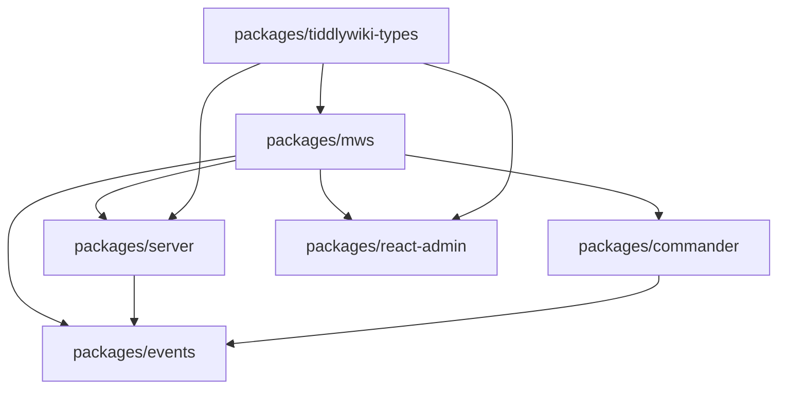

# MWS Development Guide

## Getting Started

This guide covers setting up a development environment, understanding the codebase structure, and contributing to MWS.

## Prerequisites

- **Node.js 18+**: Download from [nodejs.org](https://nodejs.org/)
- **Git**: Version control system
- **VS Code**: Recommended IDE with TypeScript support
- **Basic Knowledge**: TypeScript, Node.js, TiddlyWiki concepts

## Development Setup

### 1. Clone and Install

```bash
# Clone the repository
git clone https://github.com/TiddlyWiki/MultiWikiServer
cd MultiWikiServer

# Install dependencies
npm install

# For Android development (if needed)
npm run install-android
```

### 2. Generate SSL Certificates (Optional)

```bash
# Generate localhost certificates (Unix only)
npm run certs
```

### 3. Start Development Server

```bash
# Start with hot reload
npm start

# Start with documentation routes
npm run docs
```

The development server will be available at:
- HTTP: http://localhost:8080/dev
- HTTPS: https://localhost:8080/dev (if certificates configured)

### 4. Initial Setup

On first run, MWS creates:
- Default admin user: username `admin`, password `1234`
- SQLite database in `dev/wiki/store/`
- Password key file at `dev/wiki/passwords.key`

## Project Structure Deep Dive

### Monorepo Organization

MWS uses a monorepo structure with workspaces defined in the root `package.json`:

```json
{
  "workspaces": [
    "packages/events",
    "packages/commander", 
    "packages/server",
    "packages/mws",
    "packages/react-admin",
    "packages/tiddlywiki-types"
  ]
}
```

### Package Dependencies



### Build System

The project uses several build tools:

- **tsup**: TypeScript bundler for packages
- **esbuild**: Fast development builds for React admin
- **tsc**: TypeScript compiler for type checking
- **Prisma**: Database schema and client generation

### Key Configuration Files

- `tsconfig.base.json` - Base TypeScript configuration
- `tsconfig.types.json` - Type generation configuration  
- `tsup.config.ts` - Main build configuration
- `prisma/schema.prisma` - Database schema
- `scripts.mjs` - Custom build scripts

## Development Workflows

### 1. Making Changes

The development server automatically rebuilds when you make changes:

```bash
# Start development mode
npm start

# In another terminal, make changes to any TypeScript file
# The server will automatically rebuild and restart
```

### 2. Type Checking

```bash
# Check types across all packages
npm run tsc

# Check specific package
cd packages/server
npm run tsc
```

### 3. Building for Production

```bash
# Full production build
npm run build

# Build specific components
npm run build:admin  # React admin interface only
```

### 4. Testing

```bash
# Run test suite
npm test

# Run tests with fresh install (like CI)
npm run test:pack

# Full test including build verification
npm run fulltest
```

## Understanding the Codebase

### 1. Entry Points

**Main Entry**: `packages/mws/src/index.ts`
```typescript
export default async function runMWS(oldOptions: any) {
  await opaque.ready;
  await startup();
  await runCLI();
}
```

**CLI Entry**: `mws.run.mjs`
```javascript
import startServer from "./dist/mws.js";
startServer().catch(console.log);
```

### 2. Event System

The entire application is built around events:

```typescript
// Define event types
interface ServerEventsMap {
  "mws.init.before": [config: ServerState, $tw: TW];
  "mws.init.after": [config: ServerState, $tw: TW];
  // ... more events
}

// Emit events
await serverEvents.emitAsync("mws.init.before", config, $tw);

// Listen to events
serverEvents.on("mws.init.before", async (config, $tw) => {
  // Initialization logic
});
```

### 3. Request Processing

Request handling flows through several layers:

```typescript
// 1. HTTP Listener
class ListenerBase {
  handleRequest(req, res) {
    this.router.handle(req, res, this.options);
  }
}

// 2. Router
class Router {
  async handleRequest(req, res, options) {
    const streamer = new Streamer(req, res);
    // ... route matching and processing
  }
}

// 3. Route Handler
Z2.GET("/api/users")
  .response(UserSchema)
  .register(router, async (state) => {
    return await getUsers(state.query);
  });
```

### 4. Database Operations

Database access is centralized through the ServerState:

```typescript
class ServerState {
  async $transaction<R>(
    fn: (prisma: PrismaTxnClient) => Promise<R>
  ): Promise<R> {
    return this.engine.$transaction(fn);
  }
}

// Usage
await config.$transaction(async (prisma) => {
  const user = await prisma.users.create({
    data: { username, email, password }
  });
  return user;
});
```

## Adding New Features

### 1. Adding a New API Endpoint

```typescript
// 1. Define the schema
const CreateWidgetSchema = z.object({
  name: z.string(),
  type: z.string(),
  config: z.record(z.any())
});

// 2. Register the route
Z2.POST("/api/widgets")
  .body("json", CreateWidgetSchema)
  .response(WidgetSchema)
  .register(router.rootRoute, async (state) => {
    // Validate permissions
    if (!state.user?.hasPermission("WRITE")) {
      throw new Error("Unauthorized");
    }
    
    // Create widget
    const widget = await state.config.$transaction(async (prisma) => {
      return await prisma.widgets.create({
        data: state.data
      });
    });
    
    return widget;
  });
```

### 2. Adding a New CLI Command

```typescript
// 1. Create command file: packages/mws/src/commands/my-command.ts
export const info: CommandInfo = {
  name: "my-command",
  description: "Does something useful",
  arguments: ["<input>"],
  options: [
    ["--verbose", "Enable verbose output"]
  ]
};

export class Command extends BaseCommand<typeof info> {
  async execute() {
    const { input } = this.args;
    const { verbose } = this.options;
    
    // Command implementation
    console.log(`Processing ${input}...`);
  }
}

// 2. Register in packages/mws/src/commands/index.ts
export const commands = {
  // ... existing commands
  my_command: { info, Command }
};
```

### 3. Adding Database Schema Changes

```sql
-- 1. Create migration file
-- prisma/migrations/20240101000000_add_widgets/migration.sql

CREATE TABLE "widgets" (
    "id" TEXT NOT NULL PRIMARY KEY DEFAULT (uuid(7)),
    "name" TEXT NOT NULL,
    "type" TEXT NOT NULL,
    "config" TEXT NOT NULL,
    "created_at" DATETIME NOT NULL DEFAULT CURRENT_TIMESTAMP
);
```

```typescript
// 2. Update schema.prisma
model Widgets {
  id         String   @id @default(uuid(7))
  name       String
  type       String  
  config     Json
  created_at DateTime @default(now())

  @@map("widgets")
}

// 3. Generate Prisma client
// npm run prisma:generate
```

### 4. Adding React Admin Components

```typescript
// packages/react-admin/src/components/WidgetManager.tsx
import React from 'react';
import { useApi } from '../hooks/useApi';

export const WidgetManager: React.FC = () => {
  const { data: widgets, loading } = useApi<Widget[]>('/api/widgets');
  
  if (loading) return <div>Loading...</div>;
  
  return (
    <div>
      <h2>Widget Manager</h2>
      {widgets?.map(widget => (
        <div key={widget.id}>
          <h3>{widget.name}</h3>
          <p>Type: {widget.type}</p>
        </div>
      ))}
    </div>
  );
};
```

## Debugging

### 1. Server Debugging

```bash
# Enable debug output
DEBUG=* npm start

# Specific debug namespaces
DEBUG=mws:* npm start
DEBUG=prisma:query npm start
```

### 2. Database Debugging

```typescript
// View generated SQL queries
const config = new ServerState(/* ... */, engine, /* ... */);
await config.$transaction(async (prisma) => {
  // Queries will be logged if DEBUG=prisma:query
  const users = await prisma.users.findMany();
  return users;
});
```

### 3. VS Code Debugging

Create `.vscode/launch.json`:

```json
{
  "version": "0.2.0",
  "configurations": [
    {
      "name": "Debug MWS",
      "type": "node",
      "request": "launch",
      "program": "${workspaceFolder}/mws.dev.mjs",
      "env": {
        "NODE_ENV": "development",
        "DEBUG": "mws:*"
      },
      "console": "integratedTerminal"
    }
  ]
}
```

## Testing

### 1. Unit Tests

```typescript
// packages/mws/src/__tests__/ServerState.test.ts
import { describe, it, expect } from 'vitest';
import { ServerState } from '../ServerState';

describe('ServerState', () => {
  it('should initialize correctly', async () => {
    const state = new ServerState(/* ... */);
    await state.init();
    expect(state.setupRequired).toBe(false);
  });
});
```

### 2. Integration Tests

```typescript
// tests/integration/api.test.ts
import { describe, it, expect } from 'vitest';
import { request } from './helpers/request';

describe('API Integration', () => {
  it('should create and retrieve users', async () => {
    // Create user
    const createResponse = await request
      .post('/api/users')
      .send({ username: 'test', email: 'test@example.com' });
    
    expect(createResponse.status).toBe(201);
    
    // Retrieve user
    const getResponse = await request
      .get(`/api/users/${createResponse.body.id}`);
    
    expect(getResponse.body.username).toBe('test');
  });
});
```

### 3. End-to-End Tests

```typescript
// tests/e2e/wiki-creation.test.ts
import { test, expect } from '@playwright/test';

test('should create and access wiki', async ({ page }) => {
  await page.goto('/admin');
  await page.click('[data-testid="create-wiki"]');
  await page.fill('[data-testid="wiki-name"]', 'Test Wiki');
  await page.click('[data-testid="submit"]');
  
  await expect(page.locator('[data-testid="wiki-list"]'))
    .toContainText('Test Wiki');
});
```

## Performance Optimization

### 1. Database Optimization

```typescript
// Use transactions for multiple operations
await config.$transaction(async (prisma) => {
  const user = await prisma.users.create({ data: userData });
  await prisma.roles.create({ 
    data: { userId: user.id, roleId: defaultRoleId }
  });
  return user;
});

// Use includes for related data
const wikisWithTiddlers = await prisma.recipes.findMany({
  include: {
    recipe_bags: {
      include: {
        bag: {
          include: {
            tiddlers: true
          }
        }
      }
    }
  }
});
```

### 2. Caching

```typescript
// packages/mws/src/services/cache.ts
class TiddlerCache {
  async get(key: string): Promise<any> {
    // Check memory cache first
    const cached = this.memoryCache.get(key);
    if (cached) return cached;
    
    // Check file cache
    const fileCached = await this.getFromFile(key);
    if (fileCached) {
      this.memoryCache.set(key, fileCached);
      return fileCached;
    }
    
    return null;
  }
}
```

### 3. Bundle Optimization

```typescript
// tsup.config.ts
export default defineConfig({
  entry: ['src/index.ts'],
  format: ['esm'],
  target: 'node18',
  bundle: true,
  minify: true,
  sourcemap: true,
  splitting: true,
  treeshake: true,
  external: [
    'tiddlywiki',
    'sqlite3',
    // Other external dependencies
  ]
});
```

## Common Patterns

### 1. Error Handling

```typescript
// Centralized error handling
class MWSError extends Error {
  constructor(
    message: string,
    public code: string,
    public statusCode: number = 500
  ) {
    super(message);
  }
}

// Route error handling
Z2.GET("/api/data")
  .register(router, async (state) => {
    try {
      return await getData();
    } catch (error) {
      if (error instanceof ValidationError) {
        throw new MWSError(error.message, "VALIDATION_ERROR", 400);
      }
      throw error;
    }
  });
```

### 2. Middleware Pattern

```typescript
// Authentication middleware
const requireAuth = (handler: RouteHandler) => {
  return async (state: ServerRequest) => {
    if (!state.user) {
      throw new MWSError("Unauthorized", "AUTH_REQUIRED", 401);
    }
    return await handler(state);
  };
};

// Usage
Z2.GET("/api/protected")
  .register(router, requireAuth(async (state) => {
    return { message: "Protected data" };
  }));
```

### 3. Configuration Pattern

```typescript
// Type-safe configuration
interface ServerConfig {
  port: number;
  host: string;
  database: {
    url: string;
    pool: {
      min: number;
      max: number;
    };
  };
}

const config: ServerConfig = {
  port: Number(process.env.PORT) || 8080,
  host: process.env.HOST || 'localhost',
  database: {
    url: process.env.DATABASE_URL || 'file:./dev.db',
    pool: {
      min: 2,
      max: 10
    }
  }
};
```

## Contributing Guidelines

### 1. Code Style

- Use TypeScript strict mode
- Follow existing naming conventions
- Add JSDoc comments for public APIs
- Use Prettier for formatting
- Use ESLint for linting

### 2. Git Workflow

```bash
# Create feature branch
git checkout -b feature/my-feature

# Make changes and commit
git add .
git commit -m "feat: add new feature"

# Push and create pull request
git push origin feature/my-feature
```

### 3. Pull Request Guidelines

- Write clear PR titles and descriptions
- Include tests for new features
- Update documentation as needed
- Ensure all CI checks pass
- Request review from maintainers

### 4. Release Process

1. Update version numbers
2. Generate changelog
3. Create release tag
4. Publish to npm
5. Deploy to staging/production

## Troubleshooting

### Common Issues

1. **Build Failures**
   ```bash
   # Clear node_modules and reinstall
   rm -rf node_modules package-lock.json
   npm install
   ```

2. **Database Issues**
   ```bash
   # Reset database
   rm -rf dev/wiki/store/
   npm start  # Will recreate database
   ```

3. **Port Conflicts**
   ```bash
   # Use different port
   PORT=3000 npm start
   ```

4. **SSL Certificate Issues**
   ```bash
   # Regenerate certificates
   npm run certs
   ```

### Getting Help

- Check [GitHub Issues](https://github.com/TiddlyWiki/MultiWikiServer/issues)
- Ask in [GitHub Discussions](https://github.com/TiddlyWiki/MultiWikiServer/discussions)
- Join the [TiddlyWiki Community](https://talk.tiddlywiki.org/)

## Next Steps

After getting familiar with the development environment:

1. Explore the existing codebase
2. Try implementing a small feature
3. Write tests for your changes
4. Contribute to documentation
5. Join community discussions

The MWS project welcomes contributions of all kinds - from bug fixes to new features to documentation improvements.
